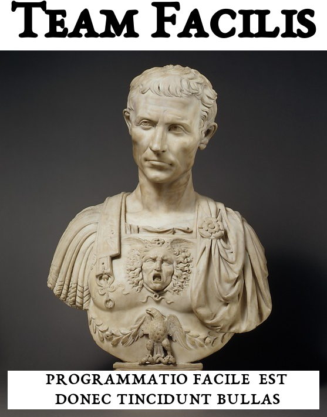

# djog_picos_2018

Gezamelijk project van Team Facilis, 
op de donderdagavond van de [Dojo](https://github.com/richelbilderbeek/Dojo) 
in schooljaar 2018-2019.

De twee belangrijkste `git` branches:

Branch||
---|---|---
`master`| | 
`develop`| | 

De `git` branches van de teamleden (op alfabet):

Branch||
---|---|---
`bas`| | 
`mad-max`| | 
`maksim`| | 
`Quinn`| | 
`richel`| | 
`rohan`| | 
`seb`| | 
`tom`| | 
`truus`| | 

## Doel

Samen een game maken, gebaseerd op [Vuurjongen en watermeisje](https://fireboy-and-watergirl.com/).

  * [gedrag](doc/gedrag.md)
  * [git](https://github.com/richelbilderbeek/git_voor_jonge_tieners)
  * [planning](doc/planning.md)
  * [team](team/README.md)
  * [video's](doc/videos.md)

## Sprites

 * Van [hier](http://www.videogamesprites.net/ChronoTrigger/Enemies/Prehistoric/1.html)

## Voortgang

## Links

 * [C++ voor jonge tieners](https://github.com/richelbilderbeek/cpp_voor_jonge_tieners)
<<<<<<< HEAD
 * [Dojo](https://github.com/richelbilderbeek/Dojo)
 * [git voor jonge tieners](https://github.com/richelbilderbeek/git_voor_jonge_tieners)
=======

Truus was here!
>>>>>>> truus
